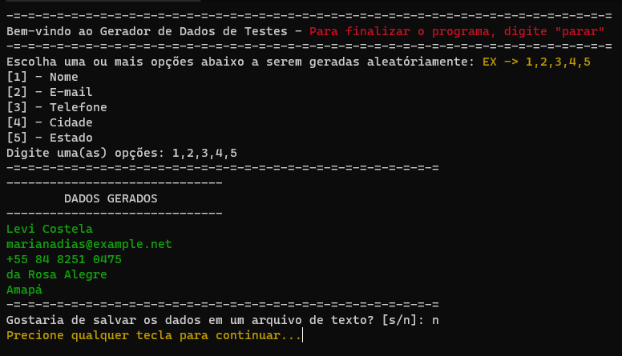

<div align="center">

</div>
<div align="center">
  
<p> </p>

</div>


##  - Objetivo 🛠️
Este projeto foi criado para enviar dados falsos em sites indesejados. Às vezes precisamos colocar dados para acessar alguns recursos do site e se você não quiser receber as mensagens de spam no e-mail, use este aplicativo!



##  - Tecnologias 🚀️
Neste projeto eu usei **Faker** um módulo python que entrega dados falsos.


##  - Como configurar 🧑‍💻
Primeiro clone este projeto usando:
```
git clone https://github.com/LuanCarvalho0/gerador-dados-falsos
```
Depois disso, abra seu terminal na pasta do projeto e execute:
```
pip install -r requisitos.txt
```
Depois disso é só executar o arquivo python e tudo deve estar funcionando! 👌
